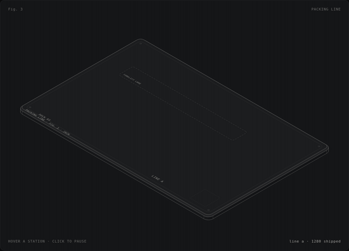
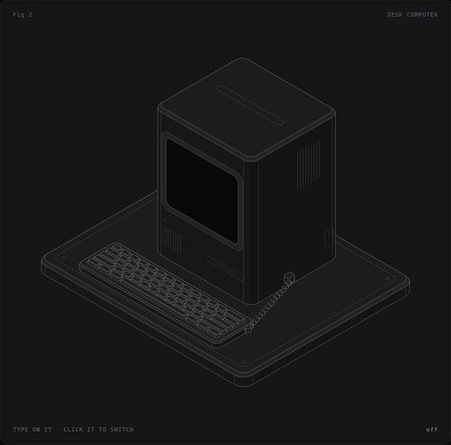
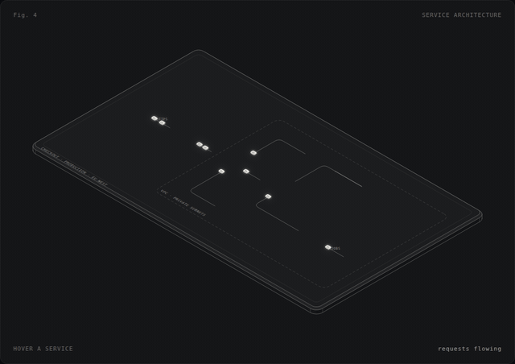
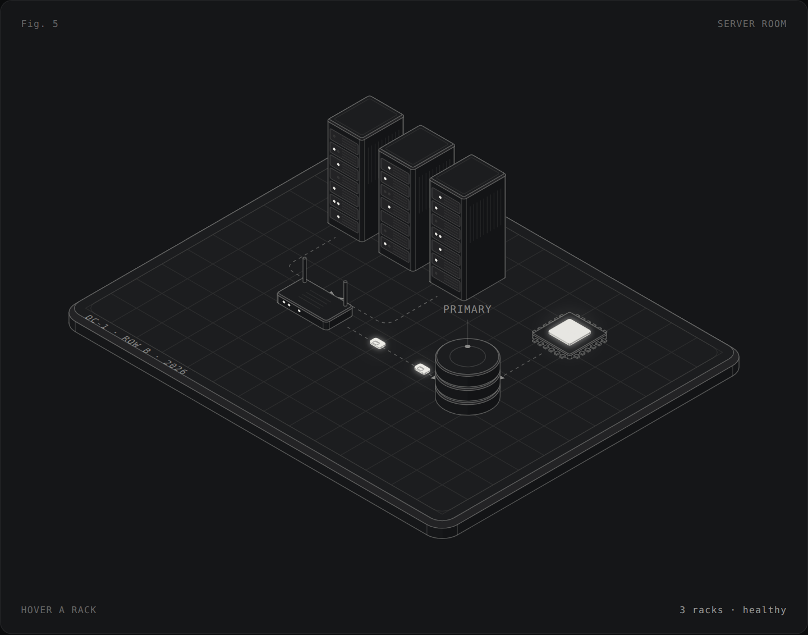

# Iso — ilustraciones isométricas

Un motor de ilustración, diagramas y animación isométrica en SVG (sin dependencias en tiempo de
ejecución, ~35 KB gzip) y una **skill portable** para que cualquier agente cree estas figuras de forma
pulida y repetible.

| | |
|---|---|
|  |  |
| **Fig. 3 · Packing line** — las cajas salen abiertas de la formadora, se precintan en el túnel, giran en la esquina, reciben su etiqueta en el escáner y entran en el camión; una carretilla trabaja entre las estanterías. | **Fig. 2 · Desk computer** — clic para encender (línea CRT → apertura → brillo) y escribe en tu teclado. |
|  |  |
| **Fig. 4 · Arquitectura** — diagrama a partir de datos: nodos en rejilla, aristas enrutadas, paquetes en tránsito. | **Fig. 5 · Server room** — la figura entera es un JSON renderizado con `Iso.render()`. |

## Empezar

```bash
npm install          # solo herramientas de desarrollo (esbuild, playwright)
npm run build        # engine/src → dist/iso.js (+ copia en la skill)
npm run serve        # http://localhost:8080 → galería, ejemplos y playground
npm test             # tests unitarios + render de cada ejemplo sin errores
```

Los ejemplos también funcionan abriendo el HTML directamente (`file://`).

```html
<div id="app"></div>
<script src="dist/iso.js"></script>
<script>
  const s = Iso.scene('#app', { figure: { index: 'Fig. 1', title: 'Hello' } });
  s.platform({ size: [160, 120] });          // la superficie superior es z = 0
  s.laptop({ at: [-10, 0, 0] });             // prefabs: `at` = centro de la huella
  s.card({ id: 'card', at: [44, 24, 0] });   // el "momento iluminado"
  s.float('card', { amp: 4 });
  s.assemble();                              // entrada escalonada
</script>
```

## Qué incluye

**Motor** (`engine/src/`)
- Proyección isométrica real (30°) o dimétrica 2:1; ejes `x` → abajo-derecha, `y` → abajo-izquierda, `z` → arriba.
- Primitivas: cajas redondeadas con chaflán, prismas (convexos y cóncavos), cilindros, conos, anillos
  segmentados, esferas, paneles (móviles/pantallas), poliedros, texto sobre planos, conectores
  ortogonales, cintas, hélices, contenido 2D sobre cualquier cara.
- **Ordenación de profundidad** topológica por ejes separadores, con resolución por menor penetración;
  los objetos en movimiento se recolocan en cada fotograma.
- **Animación** determinista: líneas de tiempo (`to/from/fromTo/set/call`, posiciones relativas,
  stagger por profundidad), tweens reactivos y presets: `assemble`, `float`, `travel`, `orbit`, `pulse`,
  `blink`, `spin`, `drawOn`, `typewriter`, `hoverLift`. Respeta `prefers-reduced-motion`.
- **Interacción**: clic, hover, teclado (Tab + Enter), estado en el pie de figura.
- **Temas**: `dark`, `light`, `paper`, `blueprint`, `terminal` o tu paleta (`colors`); materiales
  `lit`, `glass`, `screen`, `dark`, `ghost`, `wire`, `solid`, `accent`, tintes.
- **Exportación**: SVG con colores incrustados, PNG; MP4/GIF/WebM fotograma a fotograma con la CLI.

**Prefabs** (35): plataforma, árboles y bosques, plantas, farolas, bancos, coches, paneles solares,
marcadores, zonas, placas, escritorio · caja de cartón, palé, estantería, carretilla elevadora, camión,
escáner, túnel · móvil, tarjeta, portátil, monitor, teclado, el ordenador de
escritorio con CRT, servidor, base de datos, chip, router · edificio, torre, portal de cristal, cinta
transportadora, pila de capas, bloque de diagrama con icono. Más 34 iconos de línea.

**Diagramas**: `s.diagram({ nodes, edges, zones })` coloca nodos en rejilla, enruta aristas, recorta las
flechas para que no queden ocultas tras nodos altos y anima paquetes.

**JSON**: `Iso.render(spec)` construye una escena desde datos (objetos, animaciones, interacciones).

## La skill (`skills/isometric-illustrations/`)

Carpeta autocontenida con formato *Agent Skills* (`SKILL.md` + referencias + motor + scripts):

- `SKILL.md` — flujo de trabajo, convenciones de colocación, reglas de estilo y checklist.
- `references/` — API completa, catálogo de prefabs, lenguaje visual, recetas de movimiento,
  composición, diagramas, formato JSON y resolución de problemas.
- `assets/iso.js` + plantillas JS y JSON.
- `scripts/new.mjs` (crear figura), `scripts/render.mjs` (PNG, hoja de contactos, GIF, MP4, SVG,
  acciones simuladas para probar interacciones), `scripts/build.mjs` (HTML autocontenido).

Instalación:

```bash
tools/install-skill.sh                    # Claude Code, usuario   (~/.claude/skills)
tools/install-skill.sh --project ../app   # Claude Code, proyecto  (../app/.claude/skills)
tools/install-skill.sh --dest <carpeta>   # cualquier agente que lea carpetas de skills (SKILL.md)
tools/install-skill.sh --zip              # dist/isometric-illustrations.zip para subir en claude.ai
```

En este repositorio la skill ya está enlazada en `.claude/skills/` y `AGENTS.md` la señala para otros
agentes. El flujo que sigue un agente: planificar en unidades de mundo → `new.mjs` → construir con
prefabs → `render.mjs` y mirar el PNG → iterar → `build.mjs` y entregar (más GIF/MP4 si hace falta).

## Playground

`playground/` — editor JSON/JS con vista previa en vivo, presets, cambio de tema y descarga de SVG,
PNG o una página HTML autocontenida. Pensado para que alguien sin código ajuste una figura.

## Estructura

```
engine/src/          motor (ES modules): math, draw, node, sort, shapes, scene, anim, paths,
                     behaviors, style, figure, export, diagram, spec, prefabs/
dist/                iso.js (global), iso.min.js, iso.esm.js
examples/            figuras de referencia (HTML individuales)
playground/          editor en vivo
skills/isometric-illustrations/   la skill portable
tests/               unitarios (node:test) + humo visual (Playwright)
tools/               bundle, instalador de la skill, utilidades de depuración
docs/img/            capturas y GIFs
```

## Origen

El estilo parte de la figura `DeskComputer` del sistema de diseño **Stoico** (líneas de 1px, rellenos
a un pelo del fondo, un único elemento iluminado) y de las referencias en vídeo (una diorama animada y el ordenador con encendido CRT). El motor generaliza aquellas primitivas en un sistema completo.

Licencia MIT.
